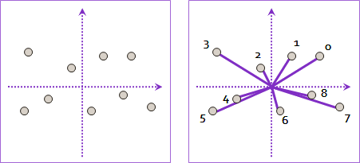

# 极角排序

> 通过一个简单的排序算法，从不同角度解决问题。

*今天第一次接触到几何类的问题，看到了一个极角排序，感觉很有用处。*

## 定义

我们平常所使用的坐标系都是直角坐标系，而极角排序是在极坐标系下进行的。
这里首先要选取一个点，然后其它点根据与参考点的连线与x轴所成的夹角的大小进行排序的。
这里我们可以简单理解为绕着一个点逆时针转圈访问。



盗一下别人家的图来用一下。。。

## 代码

对于计较排序来说，最重要的还是cmp函数的书写，这里有一下几种书写方式：

1、 利用叉积的正负来作 cmp 。

```cpp
bool cmp(const point &a, const point &b)//逆时针排序
{
    point origin;
    origin.x = origin.y = 0;
    return cross(origin,b,origin,a) < 0;
}
```

2、 用 complex 的内建函数，算出极角大小。这个函数没有用过。

```cpp
#include <complex>
#define x real()
#define y imag()
#include <algorithm>
using namespace std;

bool cmp(const Point& p1, const Point& p2)
{
    return arg(p1) < arg(p2);
}
```

3、 用 arctan 计算极角大小。注意角的大小范围是(-180°, +180°]。弧度表示。这里用 arctan2 函数应该是为了提高精度。

```cpp
bool cmp(const Point& p1, const Point& p2)
{
    return atan2(p1.y, p1.x) < atan2(p2.y, p2.x);
}
```

4、 先判断象限，再用外积判断顺序，最后根据长度排序。

```cpp
bool cmp(const Point& p1, const Point& p2)
{
    if (p1.y == 0 && p2.y == 0 && p1.x * p2.x <= 0) return p1.x > p2.x;
    if (p1.y == 0 && p1.x >= 0 && p2.y != 0) return true;
    if (p2.y == 0 && p2.x >= 0 && p1.y != 0) return false;
    if (p1.y * p2.y < 0) return p1.y > p2.y;
    double c = cross(p1, p2);
    return c > 0 || c == 0 && fabs(p1.x) < fabs(p2.x);
}
```

5、 先判断象限，再用外积判断顺序。适用于每个点的极角都不相同。

```cpp
bool cmp(const Point& p1, const Point& p2)
{
    if (p1.y > 0 && p2.y > 0)
        return p2.x * p1.y < p2.y * p1.x;
    else if (p1.y < 0 && p2.y < 0)
        return p2.x * p1.y < p2.y * p1.x;
    else if (p1.y == 0)
        if (p1.x > 0)
            return true;
        else
            return p2.y < 0;
    else if (p2.y == 0)
        if (p2.x > 0)
            return false;
        else
            return p1.y > 0;
    else
        return p1.y > 0;
}
```

最后别忘了几个重要的东西，根据自己的需要修改吧。

```cpp
//外积
double cross(const Point& a, const Point& b)
{
    return a.x * b.y - a.y * b.x;
}

//排序方法
void sort_points_by_polar_angle()
{
    Point p[100];
    sort(p, p+N, cmp);
}
```

****
补充一下在题目中遇到的极角排序的 cmp 函数的写法：

```cpp
//用法：以左下角的点p[0]为基点进行极角排序
int cmp(point a, point b)
{
    double ans = multi(a, b, p[0]);
    if(ans > 0) return 1;
    if(ans == 0 && (dis(a, p[0]) <= dis(b, p[0]))) return 1;
    return 0;
}
```

## 参考内容

+ [演算法筆記 - Point, Line, Plane](http://www.csie.ntnu.edu.tw/~u91029/PointLinePlane2.html)
+ [POJ 2007(计算几何初步——极角排序) - Dev-T](http://www.cnblogs.com/devtang/archive/2012/02/01/2334977.html)
