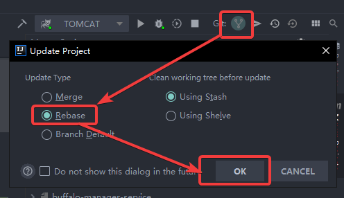
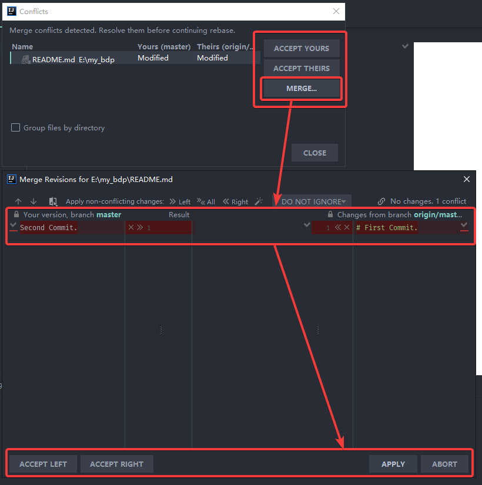

# 使用git中的rebase简化commit提交历史

Git作为“现代”开发中不可获取的一部分，平时的最常用的几个命令是 `init` `clone` `push` `pull` `origin`。但Git包含的功能却远远不止这些。说起命令，就想起之前面试官提到了`rebase`，然后就尝试了一下`rebase`这个命令，最后发现这完全是强迫症的福利。只要平时的开发流里再多几个简单操作，世界就能变得很美好，而且有了IDE的加持，用起来更加简单便捷了。然后，虽然这个前言感觉很唐突，天道好轮回，技术债也是要还的。

## 合并的策略

合并从场景来说分为两种， *不同分支的合并* 和 *单个分支的合并* 。

不同分支的合并这个没什么可说的，参照 `git merge --no-ff xxx` 的命令执行。
而单个分支的合并一般在多人开发同一个分支的时候，如果有人提前提交到了远程仓库，那么其它人再想提交的话，就必须先把远程仓库的修改合并到本地，才能再次提交。

同事们大多数都是commit后发现提交不上去，然后pull一下执行一次同分支合并。这样提交记录里就会华丽丽的看到很多分支自己merge自己的情况了，而这种提交记录是完全没有必要的。（忽略黑黑的打码）


marge 特点：自动创建一个新的commit
如果合并的时候遇到冲突，仅需要修改后重新commit
优点：记录了真实的commit情况，包括每个分支的详情
缺点：因为每次merge会自动产生一个merge commit，所以在使用一些git的GUI tools，特别是commit比较频繁时，看到分支很杂乱。

rebase 特点：会合并之前的commit历史
优点：得到更简洁的项目历史，去掉了merge commit
缺点：如果合并出现代码问题不容易定位，因为re-write了history

__单分支__ 下，建议使用rebase将远程分支更新到本地。 __多分支__ 合并，使用merge策略合并分支。

## rebase使用

rebase的其它用法就不再介绍了（其实是暂时用不上，等用上了再说），只说明一下pull的时候的用法。

有人可能会说，那我在commit之前先pull一下，这样不就可以了？

这种方法完全可以，“事前”可以用来规避单分支合并出现无用commit的问题，但是不小心到“事后”了会怎样。

rebase使用起来非常简单，命令行模式下记得在pull的后加 `--rebase` 参数。常用命令如下：

```base
git pull --rebase     # 以rebase方式拉取代码

# 遇到冲突时
git rebase --continue # 遇到冲突，解决冲突后执行，继续rebase剩余代码
git rebase --skip     # 忽略冲突的commit，继续rebase剩余代码
git rebase --abort    # 终止rebase，回到rebase执行前状态
```

GUI以Intellij为例

提交代码前先更新项目，使用rebase方式



遇到冲突时解决冲突，IDE会自动执行 --continue 命令。



与平时使用的merge真的很像。

## 总结一下

rebase的一些用法：
1. 合并多个commit为一个完整的commit
2. 将某一段commit粘贴到另一个分支上

rebase实质是丢弃一些现有的提交，然后相应地新建一些内容一样但实际上不同的提交。

**rebase会改写历史记录，永远不要在已经push了的commit上使用。**

还是稍微吐槽一下 *变基* 这个名词吧，感觉很magic:star:

## 参考内容

+ [Rebase 代替合并](https://www.git-tower.com/learn/git/ebook/cn/command-line/advanced-topics/rebase)
+ [git rebase 和 git merge 的区别](https://www.jianshu.com/p/f23f72251abc)
