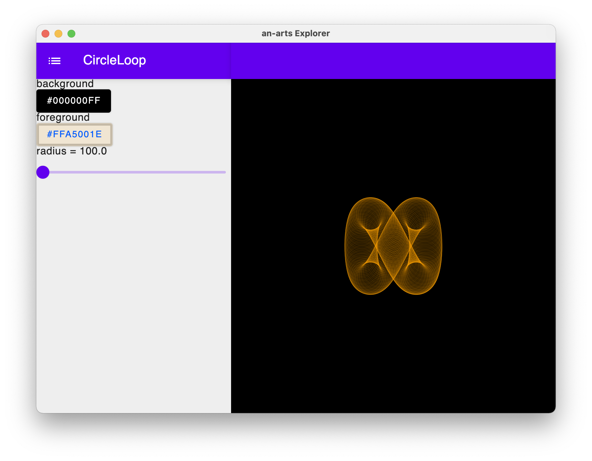

# 使用Jetpack Compose For Desktop创建生成式艺术和算法创作探索程序

日常刷微博的时候，发现了有人推荐一个生成式艺术的github仓库，看到里面的样例图片，展示出的艺术形式看起来很不错。不过这个代码是用go语言编写的，而且只支持命令行模式，没有图像化的界面。本着重复造轮子的思想，就想着能不能用kotlin重新来一遍，又考虑到最近关注的 **jetpack compose for desktop** ，就这样一个整合式的想法就诞生了。

这个程序到底是干什么？也没有什么定论。不要问，问就是 **艺术** ！总之喜欢什么就往里放什么，最后会变成一个大杂烩的形式。

在开始说明之前，欢迎大家前来体验，并给个三连[sumy7/an-arts](https://github.com/sumy7/an-arts)。

## 生成式艺术

如何理解生成式艺术（generative）？

> 自动生成艺术是指如果仔细观察艺术家与科学家利用计算机所做的事情，那就是让赋予计算机自主性，设计了一定的规则让它们自由发挥，从而得到了无法复制、美丽的结果。

我的理解是根据输入参数（大小、颜色、多少）和一些随机数，经过一系列的绘制变换，最终生成的一幅图像。这个过程离程序自主学习、自由发挥的场景还比较遥远。还是只能以人工的方式介入一个固定的算法。

说到绘制图像，不得不提到 Canvas ，这个神奇的名字不止出现的前端Web领域，在Android和Java也有一席之地。为了兼顾效率和成本，生成式艺术不得不借助此类技术。幸运的是，处于开发阶段的 **jetpack compose for desktop** 对 canvas 有了实现，这就为本程序鉴定了基础。

## 程序架构

第一印象下构想出来的界面是一个左右分栏，左边可以对Arts进行配置，右侧展示配置后的效果。



上图展示了浏览界面的一个效果，topbar展示当前浏览的Arts名称，点击左侧的按钮可以出现一个列表用于快速切换到其它Arts。

## 可配置化表单

借助于 **jetpack compse** 使得对响应式变量的改变能够迅速反映到界面上，有一种正在写vue的感觉。而恰恰是这种响应式，让我可以将以前在Web端构想的“自定义表单”模式在此处加以实现。

使用反射获取到配置类中的各个属性，判断属性上是否有对应的注解。根据注解的类型渲染出对应的表单项，并将注解所在的响应式变量与表单项进行绑定。

一个典型的表单项配置如下：

```kotlin
/**
 * CircleGridScale 表单项配置定义
 */
class CircleGridScaleConfig : ArtsConfig() {

    /**
     * 背景色
     */
    @get:ColorChooseFormItem(title = "background")
    val background = mutableStateOf(Color.White)

    /**
     * 前景色
     */
    @get:ColorChooseFormItem(title = "foreground")
    val foreground = mutableStateOf(Color.Black)
}
```

`@ColorChooseFormItem` 就是一个用于单个渲染颜色选择器的注解。目前已实现了静态文本、输入框、滑块、单选框、单个颜色选择和系列颜色选择的注解表单项。后续还会根据需要不断补充和完善。

操作表单项会引起绑定的响应式属性的变化，而属性的变化又会间接影响到渲染内容的刷新。整个过程就这样一气呵成。

## 支持动画

我不仅考虑了静态Arts，还想将动态的Arts也一并展示出来。谁又不爱魔性的动画呢？

说起动画就不得不提到动画渲染和主循环，动画渲染这里仍然使用Canvas进行渲染，那么主循环该如何实现？一般动画的主循环要完成两件事情——Update和Draw。Update阶段对属性进行重新计算，更新对应属性值。Draw阶段则会利用新的属性值重新绘制（这里没有使用增量过程）所有的画面。每循环一次就会完成一帧画面，不断的循环量不断的重绘，动画就这样出现了。

要支持动画就要解决Update和Draw这两个问题。Draw阶段借助于 **jetpack compse** 的 __recompse__ 过程，只要将一些关键属性设置为响应式模式，修改这些关键属性自然会引起重绘。Draw虽然解决了，但是Update还是需要一个循环来控制它。

```kotlin
LaunchedEffect(Unit) {
  while (true) {
      var lastNanos = System.nanoTime()
      withFrameNanos {
          val elapsedNanos = (it - lastNanos).coerceAtLeast(0L)
          lastNanos = it
          if (artsModel.artsType.animated && !isPause) {
              artsModel.arts.onUpdate(elapsedNanos)
          }
      }
  }
}
```

这里借助协程切入到动画效果更新中。由此作为主循环执行Update操作。

于是每个Arts就要出现三个生命周期，onInit、onUpdate和onDraw。在这三个生命周期里onInit完成变量的初始化，onUpdate对关键属性进行更新，onDraw描绘单次绘制的方法。而动画Arts和普通Arts差异仅仅体现在onUpdate是否会进行调用。


有了动画Arts类型之后，我又尝试收集一些动画效果进行实现，其中不乏对svg和javascript动画效果的迁移。

这里还实现了一个暂停播放的功能，也是非常的简单，主要原理是在循环中停掉Update的过程，相对应的Draw过程也会停止，即使发生了重绘，由于属性值没有发生变化，与上一帧也会是相同的。

## 未来

目前已经实现（借鉴？抄？迁移？）了一些生成式艺术的算法，总体感觉来说还是可以接受的。但是也不会止步于此，后续有时间还会继续进行补充，目标是《十万个生成式艺术》。

现在一进入程序就会出现一个默认的（字母序第一个）Arts，考虑到后续增多，可以考虑做个首页，从首页进入各自的详情页。

当然还有几个方面不太理想，界面还需要继续打磨，现在用的还只是默认样式，相信随着学习的深入，一定会变得越来越能看的。图像只能观看不能保存，这个暂时没有找到什么好方法解决，等以后解决了再单独开个文章进行讲解吧。

## 参考内容

+ [sumy7/an-arts](https://github.com/sumy7/an-arts)
+ [jdxyw/generativeart](https://github.com/jdxyw/generativear)
