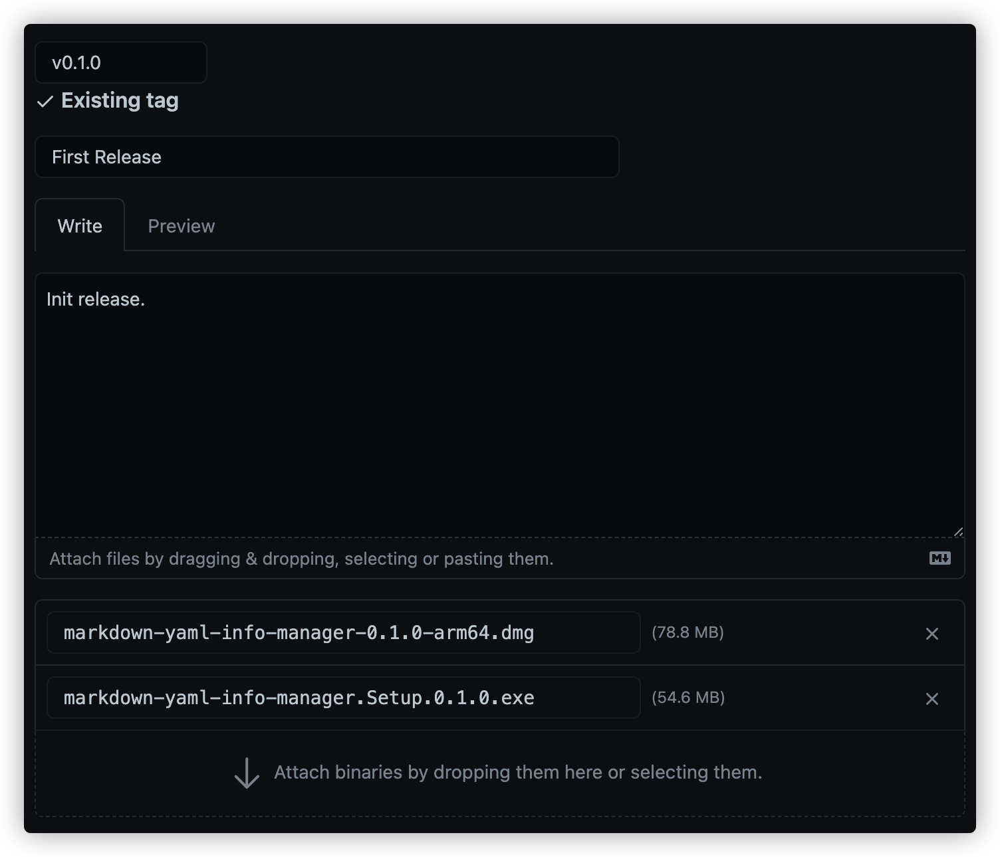

在连续捣鼓了这个应用好几天后，感觉大部分功能实现的差不多了，就打算发布一版看一下。这次打算将成品包直接放到github上，github提供了release功能。本次发布过程还只是手动的，后续考虑如何自动的构建成品并进行发布操作。不知道Github Action支不支持这个功能。

<!-- more -->

# 应用监控

发布之后如何快速获取到应用崩溃的信息？这个时候就需要一个监控来帮忙了。Sentry 是一个开源的实时错误追踪系统，提供了多种语言的错误上报接入和在线的错误分析平台，还有官方试用或者自建上报服务端的功能。

接入sentry也是非常简单，首先访问 [https://sentry.io/](https://sentry.io/) 注册并登陆，创建或使用默认的组织。

在项目中增加sentry客户端的依赖

```bash
# Using yarn
yarn add @sentry/electron

# Using npm
npm install @sentry/electron
```

在 `background.ts` 和 `main.ts` 开始的位置增加启动监控的代码：

```javascript
import * as Sentry from "@sentry/electron";

Sentry.init({ dsn: "https://xxx.xxx.xxx" });
```

需要注意的是不同项目的dsn是不同的，在官网的引导中会明确指出需要填写的dsn。而且官网的文档也有更详细的说明。

# 构建

执行项目默认的构建命令，就可以在 `dist_electron` 中生成对应操作系统的成品包：

```shell
yarn run electron:build
```

需要注意的是，在某个平台构建，只能生成对应平台的安装和运行包。比如在Windows平台下会生成.exe文件，在Mac平台下会生成.dmg镜像文件。如果要生成全部的三个平台就需要找齐对应平台的系统进行构建。

# 发布

在github仓库页面，可以新增Releases。



需要填写的内容：

+ 选择需要发布的分支，版本号。填写的版本号会自动创建Tag。
+ 填写发布标题。
+ 填写发布说明。
+ 上传构建的成品包。

保存后就成功发布了一个版本了。
