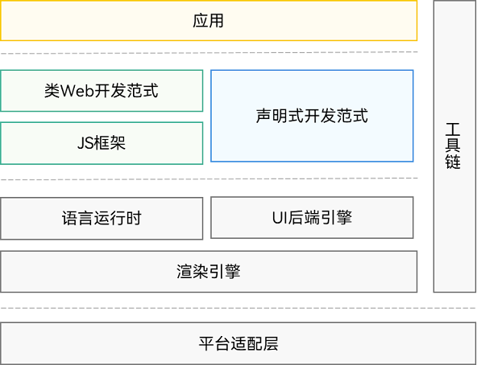
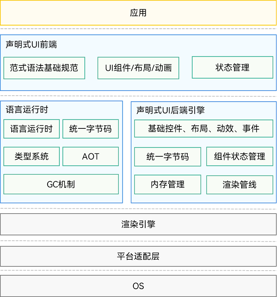
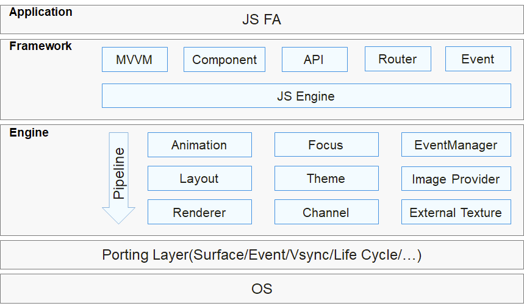

# 鸿蒙应用前端开发导读

> 鸿蒙作为一个新兴的操作系统，也在发展其独特的生态。本文将从前端开发的角度，介绍鸿蒙应用的开发流程。

## 鸿蒙与 OpenHarmony

1. **鸿蒙操作系统** 是华为研发的智能终端操作系统。
2. 华为已把该智能终端操作系统的基础能力全部捐献给开放原子开源基金会，由开放原子开源基金会整合其他参与者的贡献，
形成 [OpenHarmony](https://gitee.com/openharmony) 开源项目，最新的版本为 OpenHarmony 3.0。
3. [HarmonyOS](https://developer.harmonyos.com/) 是华为基于开源项目 OpenHarmony 开发的商用版本。

## 鸿蒙应用开发导读

随着系统的演进发展，HarmonyOS先后提供了两种应用模型：

- FA（Feature Ability）模型：HarmonyOS早期版本开始支持的模型，已经不再主推。
- Stage模型：HarmonyOS 3.1 Developer Preview版本开始新增的模型，是目前主推且会长期演进的模型。
在该模型中，由于提供了AbilityStage、WindowStage等类作为应用组件和Window窗口的“舞台”，因此称这种应用模型为Stage模型。

https://developer.harmonyos.com/cn/docs/documentation/doc-guides-V3/application-model-description-0000001493584092-V3

### UI开发

方舟开发框架（简称ArkUI）为HarmonyOS应用的UI开发提供了完整的基础设施，包括简洁的UI语法、
丰富的UI功能（组件、布局、动画以及交互事件），以及实时界面预览工具等，可以支持开发者进行可视化界面开发。

针对不同的应用场景及技术背景，方舟开发框架提供了两种开发范式，分别是[基于ArkTS的声明式开发范式](https://developer.harmonyos.com/cn/docs/documentation/doc-guides-V3/arkts-ui-development-overview-0000001438467628-V3)（简称“声明式开发范式”）
和[兼容JS的类Web开发范式](https://developer.harmonyos.com/cn/docs/documentation/doc-guides-V3/ui-js-overview-0000001428061548-V3)（简称“类Web开发范式”）。

- 声明式开发范式：采用基于TypeScript声明式UI语法扩展而来的[ArkTS语言](https://developer.harmonyos.com/cn/docs/documentation/doc-guides-V3/arkts-get-started-0000001504769321-V3)，从组件、动画和状态管理三个维度提供UI绘制能力。
- 类Web开发范式：采用经典的HTML、CSS、JavaScript三段式开发方式，即使用HML标签文件搭建布局、使用CSS文件描述样式、使用JavaScript文件处理逻辑。该范式更符合于Web前端开发者的使用习惯，便于快速将已有的Web应用改造成方舟开发框架应用。



| 应用模型        | 页面形态     | 支持的UI开发范式              |
|-------------|----------|------------------------|
| Stage模型（推荐） | 应用或服务的页面 | 声明式开发范式（推荐）            |
|             | 卡片       | 声明式开发范式（推荐<br>类Web开发范式 |
| FA模型        | 应用或服务的页面 | 声明式开发范式<br>类Web开发范式    |
|             | 卡片       | 类Web开发范式               |

#### 基于ArkTs声明式开发范式

基于ArkTS的声明式开发范式的方舟开发框架是一套开发极简、高性能、支持跨设备的UI开发框架，提供了构建HarmonyOS应用UI所必需的能力，主要包括：**ArkTS、布局、组件、页面路由和组件导航、图形、动画、交互事件**。

https://developer.harmonyos.com/cn/docs/documentation/doc-guides-V3/arkts-ui-development-overview-0000001438467628-V3



直接上例子

```ts
@Entry
@Component
struct PopupExample {
  // 属性，双向绑定
  @State handlePopup: boolean = false
 
  // 渲染函数
  build() {
    // 布局
    Column() {
      // 按钮
      Button('PopupOptions')
        .onClick(() => {
          this.handlePopup = !this.handlePopup
        })
        .bindPopup(this.handlePopup, {
          message: 'This is a popup with PopupOptions',
        })
    }.width('100%').padding({ top: 5 }) // 样式
  }
}
```

#### 基于JS的类Web开发范式

兼容JS的类Web开发范式的方舟开发框架，采用经典的HML、CSS、JavaScript三段式开发方式。使用HML标签文件进行布局搭建，使用CSS文件进行样式描述，
使用JavaScript文件进行逻辑处理。UI组件与数据之间通过单向数据绑定的方式建立关联，当数据发生变化时，UI界面自动触发更新。此种开发方式，
更接近Web前端开发者的使用习惯，快速将已有的Web应用改造成方舟开发框架应用。主要适用于界面较为简单的中小型应用开发。

https://developer.harmonyos.com/cn/docs/documentation/doc-guides-V3/ui-js-overview-0000001428061548-V3



```html
<!-- xxx.html -->
<div class="content">
  <input id="input" class="input" type="text"  maxlength="20" placeholder="Please input text" onchange="change">
  </input>
  <input class="button" type="button" value="Submit" onclick="buttonClick"></input>
</div>
```
```css
/* xxx.css */
.content {
  width: 100%;
  height: 100%;
  flex-direction: column;
  align-items: center;
  justify-content: center;
  background-color: #F1F3F5;
}
.input {
  width: 80%;
  placeholder-color: gray;
}
.button {
  width: 30%;
  margin-top: 50px;
}
```
```js
// xxx.js
import promptAction from '@ohos.promptAction' 
 export default { 
   data:{ 
     value:'', 
   }, 
   change(e){ 
     this.value = e.value; 
     promptAction.showToast({ 
     message: "value: " + this.value, 
       duration: 3000, 
      }); 
   }, 
   buttonClick(e){ 
     if(this.value.length > 6){ 
       this.$element("input").showError({        
         error:  'Up to 6 characters are allowed.'       
       }); 
      }else if(this.value.length == 0){ 
        this.$element("input").showError({         
          error:this.value + 'This field cannot be left empty.'       
        }); 
      }else{ 
        promptAction.showToast({ 
          message: "success " 
        }); 
      } 
   }, 
 }
```

### 与服务能力交互

#### 组件与自定义组件

在ArkUI中，UI显示的内容均为组件，由框架直接提供的称为系统组件，由开发者定义的称为自定义组件。可以通过将UI和部分业务逻辑封装成自定义组件。

- 自定义组件通过 @Component 进行装饰，是基本的UI单元。
- 由一个或多个自定义组件可以组成页面，通过 @Entry 装饰，可以调用页面的声明周期。

```typescript
// Index.ets
import router from '@ohos.router';

@Entry
@Component
struct MyComponent {
  @State showChild: boolean = true;

  // 只有被@Entry装饰的组件才可以调用页面的生命周期
  onPageShow() {
    console.info('Index onPageShow');
  }
  // 只有被@Entry装饰的组件才可以调用页面的生命周期
  onPageHide() {
    console.info('Index onPageHide');
  }

  // 只有被@Entry装饰的组件才可以调用页面的生命周期
  onBackPress() {
    console.info('Index onBackPress');
  }

  // 组件生命周期
  aboutToAppear() {
    console.info('MyComponent aboutToAppear');
  }

  // 组件生命周期
  aboutToDisappear() {
    console.info('MyComponent aboutToDisappear');
  }

  build() {
    Column() {
      // this.showChild为true，创建Child子组件，执行Child aboutToAppear
      if (this.showChild) {
        Child()
      }
      // this.showChild为false，删除Child子组件，执行Child aboutToDisappear
      Button('create or delete Child').onClick(() => {
        this.showChild = false;
      })
      // push到Page2页面，执行onPageHide
      Button('push to next page')
        .onClick(() => {
          router.pushUrl({ url: 'pages/Page2' });
        })
    }

  }
}

@Component
struct Child {
  @State title: string = 'Hello World';
  // 组件生命周期
  aboutToDisappear() {
    console.info('[lifeCycle] Child aboutToDisappear')
  }
  // 组件生命周期
  aboutToAppear() {
    console.info('[lifeCycle] Child aboutToAppear')
  }

  build() {
    Text(this.title).fontSize(50).onClick(() => {
      this.title = 'Hello ArkUI';
    })
  }
}
```

#### 调用基础服务

操作系统提供了许多基础服务，如通知、媒体、电话、网络等。导入模块后，就可以调用模块提供的能力。

```typescript
import NotificationManager from '@ohos.notificationManager';

let notificationRequest = {
  id: 1,
  content: {
    contentType: NotificationManager.ContentType.NOTIFICATION_CONTENT_BASIC_TEXT, // 普通文本类型通知
    normal: {
      title: 'test_title',
      text: 'test_text',
      additionalText: 'test_additionalText',
    }
  }
}

NotificationManager.publish(notificationRequest, (err) => {
    if (err) {
        console.error(`[ANS] failed to publish, error[${err}]`);
        return;
    }
    console.info(`[ANS] publish success`);
});
```

## 鸿蒙开发：前端开发者的机遇与挑战

### 基于JS的类Web开发范式更适合前端工作者

从开发体验和语法来看，基于JS的类Web开发范式类似于Vue的写法。通用的MVVM框架思想，类小程序的架构，都大大降低了上手成本。

基于JS的类Web开发范式，也为前端页面的多端适配提供了一个很好的切入点。小程序多端适配框架 Taro 从 v3.5 版本开始已经可以转换成鸿蒙 APP。

https://docs.taro.zone/docs/harmony

### ArkTS鸿蒙开发的大趋势

从最新的鸿蒙系统开始，官方在大力推荐Stage应用模型和ArkTs语言开发。

ArkTS是在TypeScript基础上，扩展了声明式UI、状态管理和并发任务的能力。

前端开发者在迁移到ArkTS上存在先天的优势：
1. TypeScript基础：ArkTS基于TypeScript，如果前端工作者已经熟悉TypeScript，那么他们将会更容易理解和使用ArkTS。
2. 状态管理：ArkTS内置了状态管理的功能，与Vue的属性管理非常相似，类比其思想会更容易上手ArkTS的状态管理。
3. 声明式UI：ArkTS使用声明式UI，最接近的莫过于Jetpack Compose。官方提供了很好的文档和示例，帮助前端开发者快速上手。
4. 并发任务：ArkTS支持并发任务，这对于处理异步操作和并发问题非常有帮助。ArkTS已经支持前端工作者非常熟悉的Promise或async/await。但是它也提供了高级的线程模型，这部分需要进一步熟悉。
